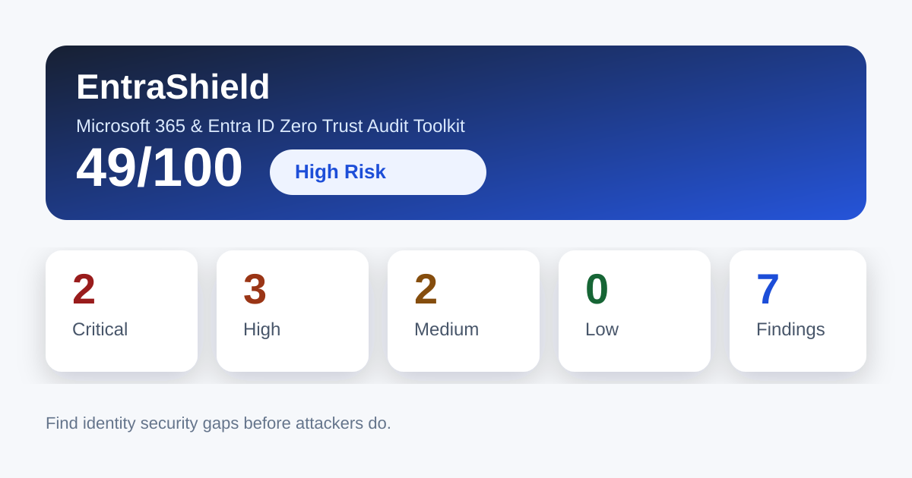

# EntraShield

**Find identity security gaps before attackers do.**

EntraShield is an open-source Microsoft 365 and Microsoft Entra ID security audit toolkit focused on Zero Trust, MFA, phishing-resistant authentication, privileged access, Conditional Access, Exchange Online exposure, guest access, and domain email security.

The project is designed for Microsoft 365 administrators, cloud engineers, security analysts, and MSP teams who want a practical way to review common identity security weaknesses and produce a clean executive-style report.

> Current status: **v0.8.0 release candidate / remediation, sanitized export, and demo site**  
> The project supports demo mode, read-only live collection for Microsoft Graph, optional Exchange Online mailbox forwarding / inbox rule inspection, category-based scoring, collector status tracking, remediation plan generation, sanitized export, GitHub Pages demo assets, environment checks, example scripts, and Pester-based test scaffolding.

---

## Why EntraShield?

Identity is now one of the most attacked layers in enterprise environments. Many breaches start with a compromised mailbox, a phished MFA prompt, an over-privileged admin account, weak recovery process, legacy authentication, or a forgotten guest user.

EntraShield helps answer questions like:

- Are privileged users protected with phishing-resistant MFA?
- Is SMS still used as a primary or fallback authentication method?
- Are FIDO2/passkeys enabled and adopted?
- Are Conditional Access policies aligned with a Zero Trust baseline?
- Are there too many Global Administrators?
- Are guest accounts stale or unmanaged?
- Are SPF, DKIM, and DMARC configured correctly?
- Are there suspicious external forwarding rules in Exchange Online?

---

## Sample Report Preview



Open the full sample output:

- [Sample HTML report](reports/sample-report.html)
- [Sample Markdown report](reports/sample-report.md)

---

## Key Features

- MFA and authentication methods audit
- FIDO2 / passkey readiness assessment
- Privileged role review
- Conditional Access baseline validation
- Legacy authentication exposure check
- Exchange Online forwarding and inbox rule review
- Guest user and external access review
- SPF, DKIM, and DMARC domain security check
- Risk-based scoring model
- HTML, Markdown, and JSON reporting
- Demo mode with sample data
- Read-only first approach for safe auditing

---

## Current Audit Categories

| Category | What it checks |
|---|---|
| Authentication | MFA registration, SMS usage, weak methods, phishing-resistant methods |
| FIDO2 Readiness | FIDO2/passkey policy, admin adoption, Temporary Access Pass readiness, authentication strength |
| Privileged Access | Global Admin count, inactive admins, emergency accounts, excessive standing privilege |
| Conditional Access | Legacy auth blocking, admin MFA, phishing-resistant MFA, risky sign-ins, compliant devices |
| Exchange Security | External forwarding, suspicious inbox rules, mailbox exposure indicators |
| Guest Access | Stale guest users, old external accounts, unmanaged collaboration risk |
| Domain Email Security | SPF, DKIM, and DMARC posture |

---

## Quick Start: Demo Mode

Demo mode does not require a Microsoft tenant. It uses sample JSON data stored in `tests/sample-data`.

If PowerShell blocks local scripts, run this for the current session:

```powershell
Set-ExecutionPolicy -Scope Process -ExecutionPolicy Bypass
```

Import the module and run a demo audit:

```powershell
Import-Module ./src/EntraShield.psm1 -Force
Invoke-EntraShieldAudit -DemoMode -OutputPath ./reports
```

Run a local health check:

```powershell
Test-EntraShieldEnvironment | Format-Table -AutoSize
```

Or run the helper script:

```powershell
./tools/Test-EntraShieldLocal.ps1
```

Generate a sanitized demo report and remediation plan:

```powershell
Invoke-EntraShieldAudit -DemoMode -Sanitize -GenerateRemediationPlan -OutputPath ./reports/sanitized-demo -OpenReport
```

This generates:

```text
reports/entra-shield-report.html
reports/entra-shield-report.md
reports/entra-shield-findings.json
```

---

## Live Tenant Mode: Microsoft Graph Read-Only Preview

Live tenant mode uses Microsoft Graph and, optionally, Exchange Online PowerShell in a read-only manner. It currently collects:

- Users
- Authentication methods
- Directory roles and members
- Conditional Access policies
- Domains and basic DNS email security posture
- Guest users
- Authentication method policy posture
- Optional Exchange Online mailbox forwarding and suspicious inbox rules

Recommended Microsoft Graph delegated permissions:

```text
User.Read.All
Directory.Read.All
RoleManagement.Read.Directory
Policy.Read.All
Domain.Read.All
Reports.Read.All
AuditLog.Read.All
UserAuthenticationMethod.Read.All
```

Install dependencies:

```powershell
Install-Module Microsoft.Graph -Scope CurrentUser
Install-Module ExchangeOnlineManagement -Scope CurrentUser
```

Run a live Microsoft Graph read-only audit:

```powershell
Import-Module ./src/EntraShield.psm1 -Force
Connect-EntraShield
Invoke-EntraShieldAudit -Live -ContinueOnCollectorError -NoProgress -OutputPath ./reports/live
```

If you do not have permission to read authentication methods yet, you can run a partial live audit:

```powershell
Invoke-EntraShieldAudit -Live -SkipAuthenticationMethods -OutputPath ./reports/live-partial
```

Run a live audit including Exchange Online forwarding and inbox rule checks:

```powershell
Connect-EntraShield
Connect-EntraShieldExchange
Invoke-EntraShieldAudit -Live -IncludeExchangeOnline -ContinueOnCollectorError -NoProgress -OutputPath ./reports/live-exchange
```

For a small lab test, limit mailbox inspection:

```powershell
Invoke-EntraShieldAudit -Live -IncludeExchangeOnline -MailboxLimit 5 -ContinueOnCollectorError -NoProgress -OutputPath ./reports/live-exchange-test
```

If you want mailbox-level forwarding only and want to skip inbox rule inspection:

```powershell
Invoke-EntraShieldAudit -Live -IncludeExchangeOnline -SkipInboxRules -OutputPath ./reports/live-exchange-forwarding-only
```

For detailed setup, see:

```text
docs/live-tenant-setup.md
docs/exchange-online-setup.md
```

> Note: Exchange Online collection is optional. Run `Connect-EntraShieldExchange` first and use `-IncludeExchangeOnline`. Do not run against production mailboxes unless you have explicit permission.

---

## Example Finding

```text
Finding ID: ES-MFA-001
Title: Privileged users without phishing-resistant MFA
Severity: Critical
Category: Authentication
Impact: A compromised privileged account may lead to full tenant takeover.
Recommendation: Require FIDO2 security keys, passkeys, certificate-based authentication, or Windows Hello for Business for privileged roles.
```

---

## Scoring Model

EntraShield calculates a score from 0 to 100.

| Score | Rating |
|---|---|
| 85-100 | Strong |
| 70-84 | Good |
| 50-69 | Needs Improvement |
| 0-49 | High Risk |

Current scoring categories:

```text
Authentication Security: 25 points
Privileged Access:      20 points
Conditional Access:     20 points
Exchange Security:      15 points
Guest Access:           10 points
Domain Email Security:  10 points
```

---

## Testing

Run Pester tests locally:

```powershell
Install-Module Pester -Scope CurrentUser -Force -SkipPublisherCheck
Invoke-Pester -Path ./tests
```

More details:

```text
docs/testing.md
```

---

## Documentation

- Live tenant setup: `docs/live-tenant-setup.md`
- Exchange Online setup: `docs/exchange-online-setup.md`
- Scoring model: `docs/scoring-model.md`
- Testing: `docs/testing.md`
- Remediation plan: `docs/remediation.md`
- Sanitized export: `docs/sanitized-export.md`
- GitHub Pages demo: `docs/github-pages.md`
- Before / after workflow: `docs/before-after-workflow.md`
- Known limitations: `docs/known-limitations.md`
- Release process: `docs/release-process.md`
- Threat model: `docs/threat-model.md`
- Examples: `examples/README.md`

---

## Suggested Deployment Roadmap

1. Start with demo mode and review the sample report.
2. Add Microsoft Graph live collectors.
3. Test in a non-production Microsoft 365 tenant.
4. Validate findings manually.
5. Add MSP-style reporting and customer branding.
6. Add remediation templates with `-WhatIf` only.

---

## Security Philosophy

EntraShield follows a **read-only first** model.

The project should never modify tenant configuration by default. Any future remediation functionality should require explicit flags such as:

```powershell
Invoke-EntraShieldRemediation -Finding ES-MFA-001 -WhatIf
```

No secrets, tokens, tenant IDs, or customer data should be committed to the repository.

---

## References

- NIST Digital Identity Guidelines SP 800-63B: https://pages.nist.gov/800-63-4/sp800-63b.html
- CISA: Implementing Phishing-Resistant MFA: https://www.cisa.gov/sites/default/files/publications/fact-sheet-implementing-phishing-resistant-mfa-508c.pdf
- FIDO Alliance FIDO2: https://fidoalliance.org/fido2/
- FIDO Alliance Passkeys: https://fidoalliance.org/passkeys/
- Microsoft Entra passwordless deployment planning: https://learn.microsoft.com/en-us/entra/identity/authentication/how-to-deploy-phishing-resistant-passwordless-authentication
- Microsoft Conditional Access: https://learn.microsoft.com/en-us/entra/identity/conditional-access/overview
- OWASP Authentication Cheat Sheet: https://cheatsheetseries.owasp.org/cheatsheets/Authentication_Cheat_Sheet.html

---

## Roadmap

### v0.1.0

- [x] Repository structure
- [x] Demo mode data model
- [x] Sample findings
- [x] HTML and Markdown sample report
- [x] PowerShell module skeleton
- [x] Documentation baseline

### v0.2.0

- [x] Microsoft Graph user collector
- [x] Authentication methods collector
- [x] Directory roles collector
- [x] Conditional Access collector
- [x] Domain collector with basic DNS checks
- [x] Guest user collector
- [x] Live vs demo mode separation
- [x] Live tenant setup documentation
- [ ] Expanded test coverage with Pester

### v0.3.0

- [x] Exchange Online live collector
- [x] Mailbox-level forwarding detection
- [x] Inbox rule forwarding detection
- [x] Suspicious inbox rule heuristics
- [x] Exchange Online setup documentation
- [ ] Pester tests
- [ ] Advanced Conditional Access parsing

### v0.4.0

- [x] Category-based scoring model
- [x] Improved MSP-style HTML and Markdown reporting
- [x] Environment check command
- [x] Local test helper script
- [x] Pester test scaffolding
- [x] GitHub Actions test workflow
- [x] Testing and release process documentation

### v0.5.0

- [x] Safer live mode with collector status tracking
- [x] `-NoProgress` option
- [x] `-OpenReport` option
- [x] Prerequisite installer helper
- [x] Example scripts
- [x] Known limitations document
- [x] Security policy
- [x] Pull request and issue templates

### v0.8.0

- [x] Remediation plan generator
- [x] `remediation-plan.md` and `remediation-plan.json`
- [x] `-GenerateRemediationPlan` option
- [x] `-Sanitize` option
- [x] Sanitized HTML, Markdown, JSON, and remediation outputs
- [x] GitHub Pages demo assets under `/docs`
- [x] Before / after workflow documentation
- [x] Remediation and sanitized export documentation

### v1.0.0

- [ ] Production-ready read-only audit
- [ ] MSP report mode
- [ ] GitHub Pages demo
- [ ] Installation script
- [ ] Full documentation
- [ ] Stable live tenant test results

---

## Hashtags / Topics

`Microsoft365` `MicrosoftEntra` `CyberSecurity` `ZeroTrust` `PowerShell` `FIDO2` `Passkeys` `Passwordless` `MFA` `CloudSecurity` `IAM` `IdentitySecurity`

---

## License

MIT License. See [LICENSE](LICENSE).
